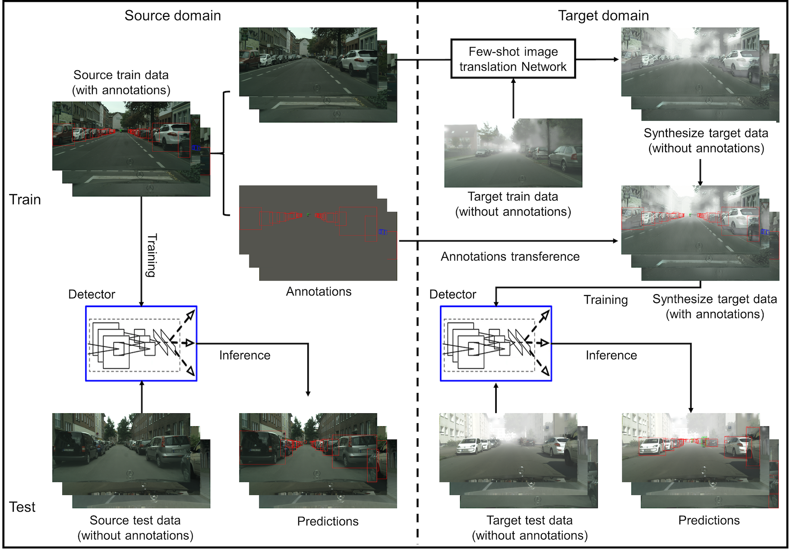
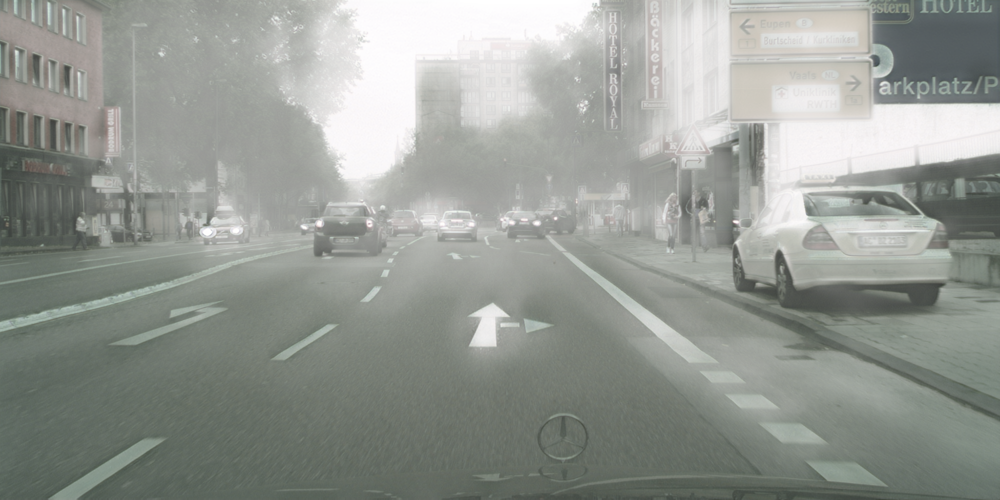
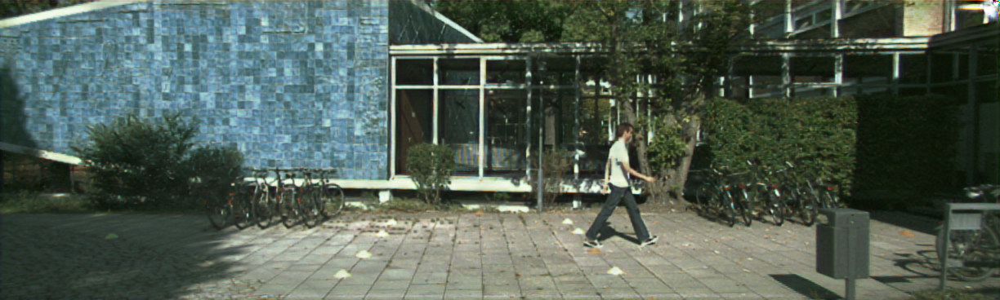
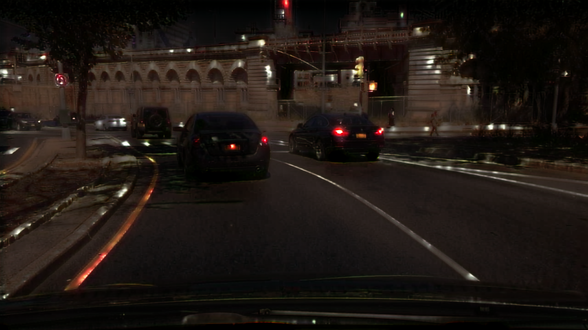
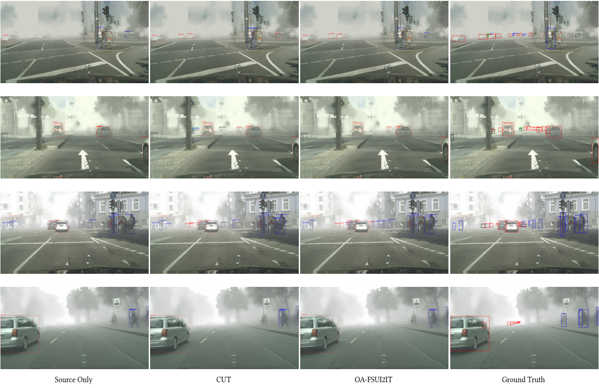
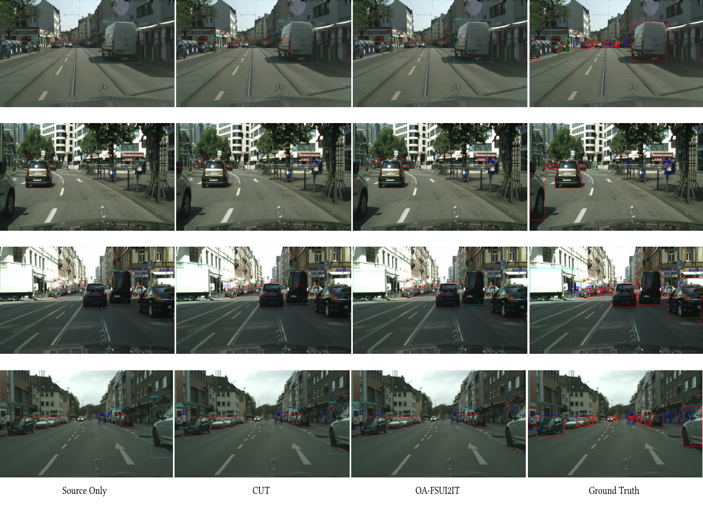
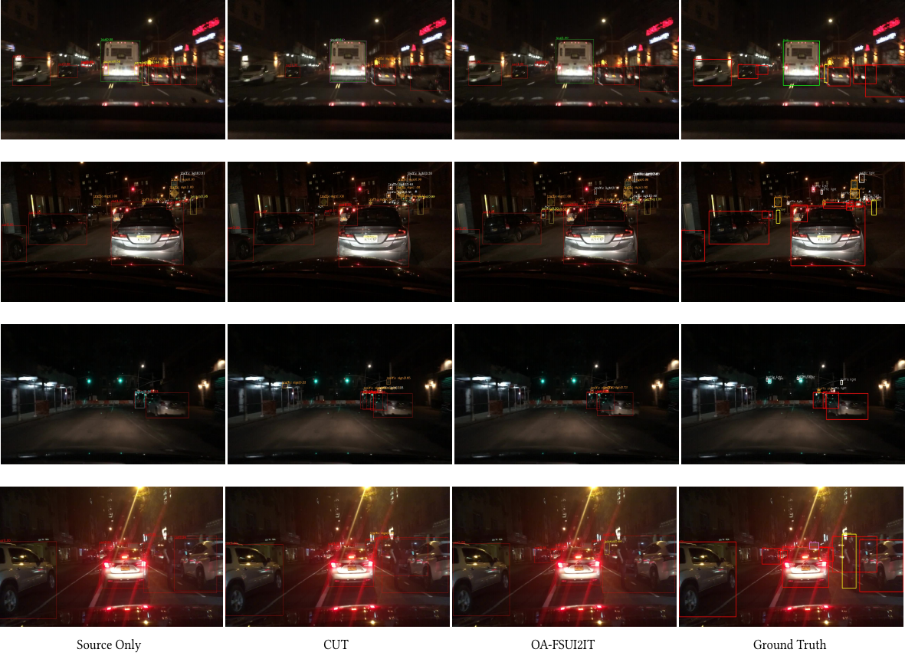
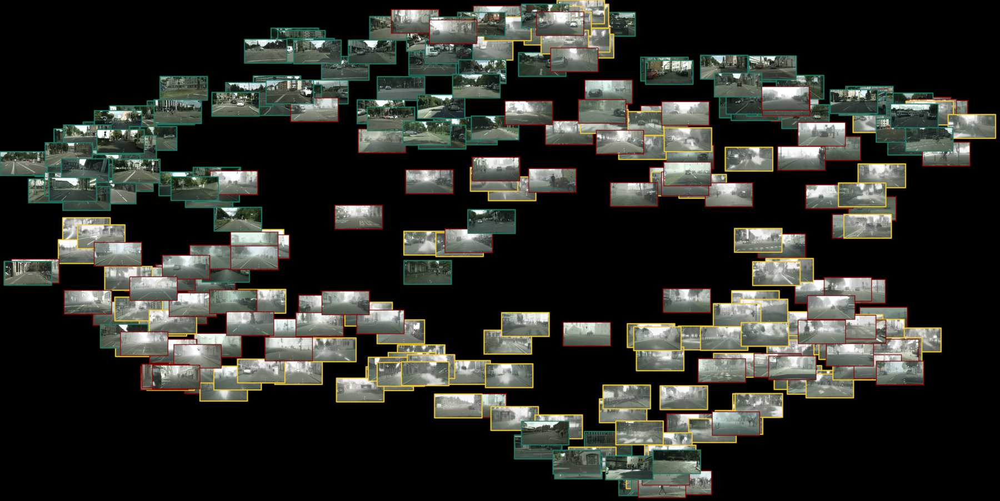
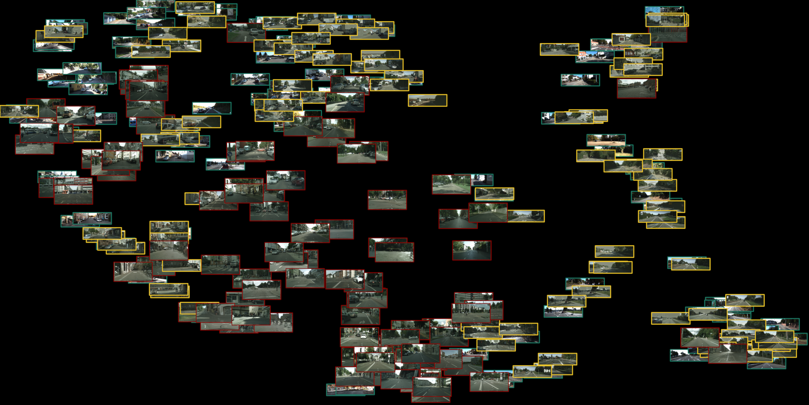
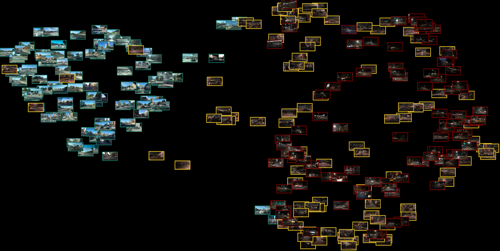

# Object-Aware Few-Shot Unsupervised Image-to-Image Translation for cross domain object detection in adverse environment with discriminator augmentation

 

   

## Introdcution

This repository contains our PyTorch implementation of Object-Aware Few-Shot Unsupervised Image-to-Image Translation (OAFSUI2IT). In this paper, we try to address the few-shot cross domain (FSCD) object detection task with limited unlabeld images in the target domain. Built upon the architecture of [CUT](https://github.com/taesungp/contrastive-unpaired-translation), our method 1) introduces adaptive discriminator augmentation module to solve the unbalanced source-target domain problem; 2) proposes pyramid patchwise contrastive learning startegy to improve the images quality; and 3) develops self-supervised content-consistency loss to enforce content matching.  Trained on the images translated by our OAFSUI2IT, object detection methods (i.e. Faster RCNN) can achieve better mAP than those trained on source only, as well as those on CUT translated images. 

## Translation Results

### Cityscapes Clear to Foggy

### KITTI to Cityscapes

### BDD100k Day to Night

## Detection Result

### Cityscapes Clear to Foggy

### KITTI to Cityscapes

### BDD100k Day to Night

## t\-SNE Result
To validate our translation method, we use TSNE to visualize distribution of images from source domain, target domain and generated.

### Cityscapes Clear to Foggy

[High Resolution Version](https://github.com/anonymous-cvlab/FSCD-Det/tsne_results/cityscapes_clear_and_foggy_and_fake_scaled3.png)

### KITTI to Cityscapes

[High Resolution Version](https://github.com/anonymous-cvlab/FSCD-Det/tsne_results/kitti_and_fake_kitti_and_cityscapes_scaled3.png)

### BDD100k Day to Night

[High Resolution Version](https://github.com/anonymous-cvlab/FSCD-Det/tsne_results/bdd100k_day_and_night_and_fake_scaled3.png)

### Acknowledgments
Our code is developed based on [contrastive-unpaired-translation](https://github.com/taesungp/contrastive-unpaired-translation/). Part of adaptive discriminator augmentation borrows from [stylegan2-ada-pytorch](https://github.com/NVlabs/stylegan2-ada-pytorch). We also thanks [pixplot](https://github.com/YaleDHLab/pix-plot) for t\-SNE visualization.